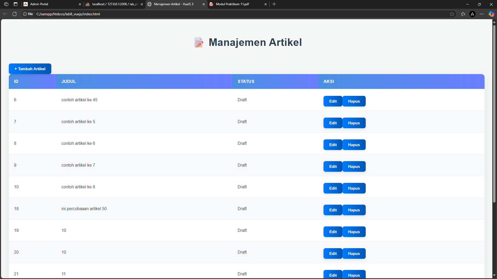
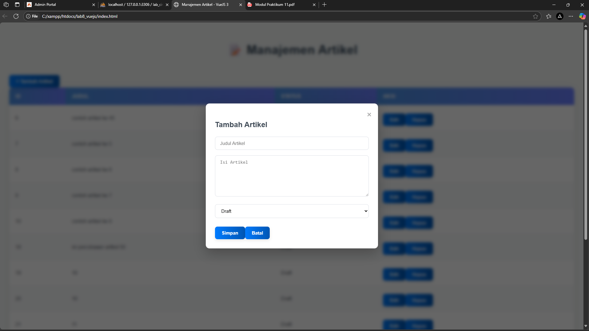
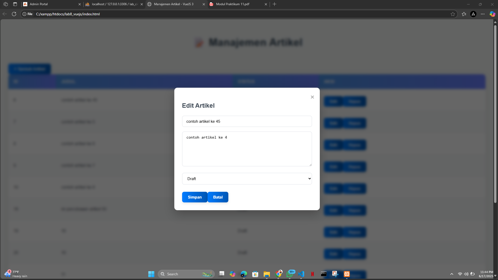
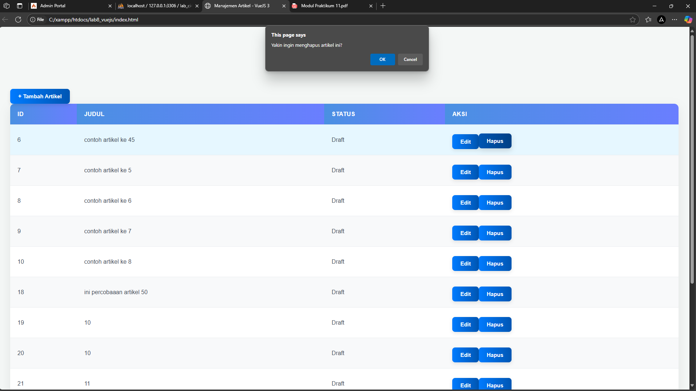

# Lab 11 Web - VueJS

Praktikum Pemrograman Web 2 - Universitas Pelita Bangsa  
Dosen: Agung Nugroho  
Modul Praktikum 11: Frontend API menggunakan VueJS 3

## 🎯 Tujuan Praktikum
1. Memahami konsep dasar API.
2. Memahami konsep dasar Framework VueJS.
3. Mampu membuat aplikasi frontend menggunakan VueJS 3 yang terhubung dengan API backend.

---

## 🛠️ Persiapan
- Text Editor: Visual Studio Code
- Browser: Google Chrome / lainnya
- Webserver: XAMPP/Laragon (untuk backend CI4 API)

**Struktur Folder:**
```
lab8_vuejs/
├── index.html
└── assets/
    ├── css/
    │   └── style.css
    └── js/
        └── app.js
```

---

## 📄 Langkah-langkah Praktikum

### 1. Membuat Tampilan Awal
- File: `index.html`
- Menampilkan daftar artikel yang diambil dari endpoint API menggunakan `axios`.

### 2. Menambahkan Form Tambah & Edit Data
- Form dinamis ditampilkan menggunakan `v-if`.
- Form memanfaatkan `v-model` untuk binding data.

### 3. Script VueJS (app.js)
- Menggunakan `Vue.createApp()` untuk membuat instance aplikasi.
- Method utama:
  - `loadData()` – memuat data dari API
  - `tambah()` – membuka form tambah
  - `edit(data)` – membuka form edit dan mengisi datanya
  - `hapus(index, id)` – menghapus data berdasarkan ID
  - `saveData()` – menyimpan data ke backend (POST/PUT)
  - `statusText(status)` – mengubah nilai status menjadi teks

### 4. Styling (style.css)
- Desain tabel dan form menggunakan CSS sederhana.
- Menambahkan modal form menggunakan class `.modal`.

---

## 🔧 Teknologi yang Digunakan
- [VueJS 3 CDN](https://unpkg.com/vue@3)
- [Axios](https://unpkg.com/axios)
- HTML, CSS
- Backend API menggunakan CodeIgniter 4

---

## 📸 Screenshot Hasil
 Sisipkan screenshot tampilan : 
1️⃣ daftar artikel

2️⃣ form tambah

3️⃣ form edit

4️⃣ hasil simpan/hapus


---

## 💡 Catatan Tambahan
- Pastikan backend CodeIgniter 4 (labci4) sudah aktif dan endpoint `http://localhost/labci4/public/post` berjalan dengan baik.
- Gunakan CORS jika mengakses API dari domain berbeda.
- Form reset otomatis setelah simpan dan modal ditutup.

---

© 2025 Universitas Pelita Bangsa
